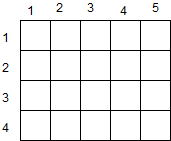
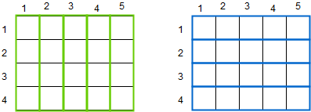
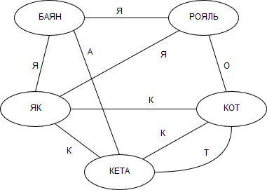
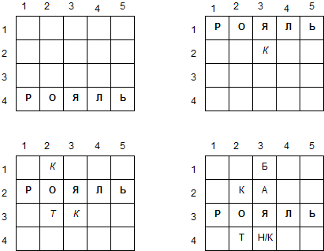
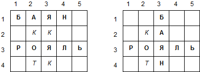
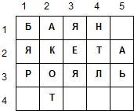
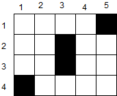
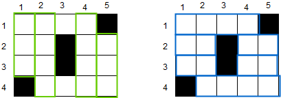
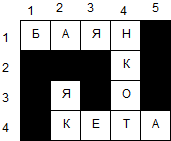

== Алгоритм генератора

Стоит сначала отметить несколько общих замечений по поводу алгоритма генератора:

* в данном алгоритме используются backtracking и look-ahead;

* важным этапом является подготовка данных, поскольку в ходе решения входные слова накладываются на шаблон из слов сетки кроссворда (см. шаги 1 и 2);

* лучшим результатом считается заполненный кроссворд с максимальным числом использованных слов и пересечений.

Для наглядности, рассмотрим алгоритм генератора канадского кроссворда на примере следующих входных данных:

* Размер поля: 4 x 5
* Слова: як, кот, баян, кета, рояль

Также для простоты будем считать, что у слов в кроссворде имеется 2 возможных направления: *Across* и *Down*.

=== Кроссворд без ограничений

Сначала разберём случай кроссворда без ограничений, когда все ячейки поля могут содержать символы:

.Шаги алгоритма:

*Шаг 1.* Составить список *Grid words* с учётом пересечений.

*Grid words* являются "словами" сетки. На первом шаге алгоритма они не содержат символов и представляют собой просто все возможные расположения слов для данного кроссворда с учётом их размеров.

Помимо этого, каждый *grid word* знает, какие другие слова он пересекает, и в какой позиции.

Для нашего примера получим такой список *grid word*-ов: +
----
1,1 A (5)        1,1 D (4)
2,1 A (5)        2,1 D (4)
3,1 A (5)        3,1 D (4)
4,1 A (5)        4,1 D (4)
                 5,1 D (4)
----

Здесь первые два числа обозначают позицию первой клетки слова, буква - направление (Across или Down), а число в скобках - длину слова.

Из картнки видно, что каждое слово по горизонтали пересекает каждре слово по вертикали, и наоборот.

*Шаг 2.* Составить список *Words* входных слов с учётом пересечений, отсортировав его по убыванию длины слов.

Для того, чтобы составить как можно более плотный кроссворд, нам нужно знать, какие вообще пересечения заданных слов возможны. Это можно представить графом, рёбра которого - буквы, в которых слова пересекаются.

Таким образом, в нашем случае отсортированный список слов с пересечениями будет выглдеть так: +
----
рояль - баян, кот, як
баян - рояль, кета, як
кета - баян, як, кот
кот _ рояль, кета, як
як - рояль, баян, кета, кот
----

*Шаг 3.* Выбрать первое слово и разместить его на сетке

В нашем случае это сделать просто, поскольку у нас есть только одно слово максимальной длины 5 - _рояль_. Если же таких слов несколько, то выбирается то, у которого, больше всего пересечений. Если самое длинное слово превышает размеры сетки, то оно не пропускается, и выбирается другое, подходящее по длине.

Теперь, чтобы разместить слово на сетке, нам нужно, выяснить, какие расположения вообще возможны. Именно для этого мы составили список *Grid Words*. Из всех *grid words* по размеру нам подходят только 4 по горизонтали:

При рассмотрении каждого возможного положения алгоритм также должен смотреть вперёд, чтобы выяснить, при каком варианте мы получим наибольшее число пересечений.

Тем не менее, положим в очередь все эти варианты, и начнём рассматривать последний. При этом счётчик использованных слов увеличится на 1.

*Шаг 4.* Разместить следующее слово.

Теперб мы должны разместить следующее по длине слово, которое имеет пересечение с первым. В выбранном нами варианте это слово _баян_.

Всего на данном этапе есть 6 вариантов размещения этого слова, но вверху очереди будут лежать следующие два:

Как можно видеть, здесь наибольшее число пересечений имеет первый вариант. Выбираем его и увеличиваем счётчик пересечений на 1.

*Шаг 5.* Проделывать предыдущий шаг до тех пор, пока все слова не будут размещены, или пока больше нельзя будет добавить слова. В конечном результате зафиксировать счётчики слов и пересечений.

На первом проходе конечное размещение слов будет таким:

*Шаг 6.* Вернуться на шаг назад и рассмотреть остальные варианты из очереди.

*Шаг 7.* Проделывать шаги  3-6  до тех пор, пока не закончатся все варианты, или пока не выйдет время.

*Шаг 8.* Выбрать лучший результат по числу использованных слов и пересечений. Если таких вариантов несколько, сделать случайную выборку.

Таким образом, на выходе алгоритма будет получен едмнственный кроссворд.

Стоит отметить, что наиболее значимой частью данного алгоритма является предобработка данных. Поскольку задача о генерации кроссворда относится к классу NP-полных, при большом объёме входных данных обычным перебором за разумно конечное время её решить невозможно. Тем не менее, в приведённом здесь алгоритме перебор тоже используется, только перебор происходит не по клеткам кроссворда, а по словам целиком.

Возможно, результативность данного алгоритма можно улучшить, если использовать на некоторых шагах случайность и выбирать комбинации слов произвольным образом.

=== Кроссворд с ограничениями

Алгоритм для кроссворда с ограничениями, на самом деле, ничем не отличается от случая без ограничений. Различие будет проявляться только в списке *grid word*-ов.

Например, для набора слов из предыдущего пункта и поля с такими ограничениями:

будут возможны следующие расположения слов в сетке:

При этом наиболее вероятный результат будет таким:

